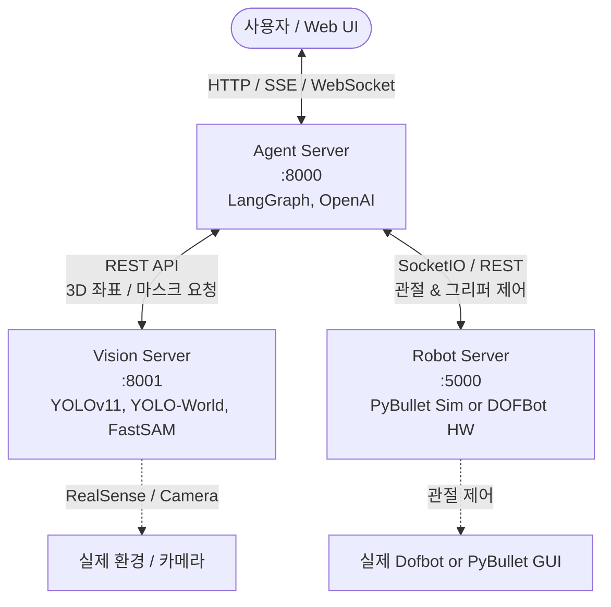

# ARMY Agent (Agentic Robot Manipulation System)

<video src="https://github.com/user-attachments/assets/10ca680a-55d9-4ad0-b068-b5576885be9d" width="100%" autoplay loop muted playsinline></video>

본 프로젝트는 대형언어모델(LLM)과 Vision AI 모델을 결합하여, 5축 다관절 로봇(DOFBot)을 자연어로 자율 제어하는 **VLA(Vision-Language-Action) 기반의 지능형 로봇 제어 시스템**입니다.  
물리 하드웨어(DOFBot)뿐만 아니라 **PyBullet 기반 가상 시뮬레이션 환경**을 지원하여 별도의 로봇 하드웨어 없이도 동작을 테스트하고 검증할 수 있습니다.

<br>

---

## 🏗️ 시스템 아키텍처 (System Architecture)

본 시스템은 3개의 독립된 마이크로서비스로 구성되어 있습니다.



- **[AI 에이전트 모듈 (`agent/`)](file:///d:/project/ARMY_agent/agent)** (Port `8000`): LangGraph 기반 에이전트 서버. 사용자 자연어 명령을 분석하고 비전 및 로봇 제어 도구를 호출하여 결과 반환.
- **[로봇 시뮬레이션 모듈 (`robot/`)](file:///d:/project/ARMY_agent/robot)** (Port `5000`): PyBullet 가상 시뮬레이터 제어 서버 (Flask/SocketIO).
- **[비전 모듈 (`vision/`)](file:///d:/project/ARMY_agent/vision)** (Port `8001`): YOLOv11, YOLO-World, FastSAM 기반 객체 탐지 및 3D 좌표 변환 서버 (FastAPI).

> [!NOTE]
> 본 저장소의 `robot/` 디렉토리는 **PyBullet 가상 시뮬레이션 전용**입니다.  
> 실제 물리 DOFBot 제어 코드는 **[DOFBOT_ROBOT_ARM](https://github.com/dangdang122/DOFBOT_ROBOT_ARM)** 레포지토리에서 관리되며, 로봇 본체(SBC/보드)에서 별도 구동 후 본 시스템(`agent`)과 네트워크(`BOT_URL`)를 통해 연동됩니다.

<br>

---

## 🛠️ 주요 도구 및 기술 스택 (Tech Stack)

- **AI / LLM:** LangGraph, LangChain, OpenAI GPT-4o / GPT-4o-mini, Ollama (Gemma, MiniMax 등 로컬 LLM)
- **Vision AI:** Ultralytics YOLOv11, YOLO-World, FastSAM
- **Simulation & Hardware:** PyBullet Simulation, DOFBot (5-DOF Robotic Arm), Intel RealSense D435
- **Backend & Comm:** FastAPI, Flask, SocketIO, Uvicorn, Python 3.10+
- **Frontend:** HTML5, Vanilla JS, CSS (Glassmorphism), Web Speech API (STT/TTS)

<br>

---

## ⚙️ 환경 설정 (Environment Setup)

프로젝트 루트 및 비전 모듈 디렉토리에 제공되는 `.env.example`을 복사하여 `.env` 파일을 생성합니다.

### 1. 루트 환경변수 설정 (`.env`)
루트 디렉토리의 `.env.example`을 복사하여 `.env`를 생성하고, 구동 환경(PyBullet 시뮬레이션 또는 실제 DOFBot) 및 LLM 설정을 진행합니다.

```bash
# Windows PowerShell
Copy-Item .env.example .env

# Linux / macOS
cp .env.example .env
```

`.env` 설정 옵션:
```env
# ==========================================
# Mode Selection
# ==========================================
# True: Physical DOFBot Hardware, False: PyBullet Simulation
DOFBOT=False

# ==========================================
# Service URLs
# ==========================================
VISION_URL=http://localhost:8001
BOT_URL=http://localhost:5000

# ==========================================
# LLM Configurations
# ==========================================
LLM_MODEL=gpt-4o-mini
LLM_BASE_URL=
API_KEY=your_openai_api_key_here
```

### 2. 비전 모듈 환경변수 설정 (`vision/.env`)
비전 모듈 디렉토리로 이동하여 `.env.example`을 복사합니다.
```bash
# vision 디렉토리 내에서
cd vision
Copy-Item .env.example .env   # (Linux/macOS: cp .env.example .env)
cd ..
```
`vision/.env` 설정값:
```env
VISION_DEBUG=False
REALSENSE=False   # PyBullet 환경: False, RealSense Depth 카메라 연결 시: True
```

<br>

---

## 🚀 실행 가이드 (Quick Start)

시스템 구동을 위해 3개의 터미널에서 각 서비스를 순서대로 실행합니다.

### 🎮 A. PyBullet 시뮬레이션 모드로 실행 (하드웨어 미보유 시)

1. **터미널 1: Robot 시뮬레이터 서버 구동 (Port 5000)**
   ```bash
   cd robot
   conda activate robot
   python main.py
   ```
   > [!NOTE]
   > PyBullet GUI 창이 열리며 가상 환경에 Dofbot 로봇팔 및 시뮬레이션 환경이 로드됩니다.

2. **터미널 2: Vision 서버 구동 (Port 8001)**
   ```bash
   cd vision
   conda activate vision
   python main.py
   ```

3. **터미널 3: AI Agent 서버 구동 (Port 8000)**
   ```bash
   cd agent
   conda activate agent
   python main.py
   ```

4. **웹 관제 UI 접속**
   - **통합 Agent 대시보드:** [http://localhost:8000](http://localhost:8000)
   - **비전 전용 관제 화면:** [http://localhost:8001](http://localhost:8001)

---

### 🦾 B. 실제 DOFBot 하드웨어 모드로 실행

1. **로봇 본체 제어 서버 구동 (DOFBot 보드)**
   - 실제 물리 로봇 제어 코드는 별도 레포지토리로 관리됩니다: **[DOFBOT_ROBOT_ARM (GitHub)](https://github.com/dangdang122/DOFBOT_ROBOT_ARM)**
   - 로봇 보드(라즈베리파이 등)에 접속하여 위 레포지토리를 클론하고 Socket.IO 제어 서버를 실행합니다:
     ```bash
     # DOFBot 로봇 보드 내부에서 실행
     git clone https://github.com/dangdang122/DOFBOT_ROBOT_ARM.git
     cd DOFBOT_ROBOT_ARM
     python main.py  # 5000번 포트 구동
     ```
2. **비전 서버 구동 (PC)**
   - RealSense Depth 카메라를 PC에 연결합니다.
   - `vision/.env`에서 `REALSENSE=True`로 변경 후 실행합니다:
     ```bash
     cd vision
     conda activate vision
     python main.py  # 8001번 포트 구동
     ```
3. **루트 환경변수 설정 (`.env`)**
   - 루트의 `.env` 파일에서 `DOFBOT=True` 및 `BOT_URL`에 로봇 보드의 IP를 입력합니다:
     ```env
     DOFBOT=True
     VISION_URL=http://localhost:8001
     BOT_URL=http://<로봇_보드_IP>:5000
     ```
4. **AI 에이전트 구동 (PC)**
   - 에이전트 서버를 실행하고 브라우저로 대시보드에 접속합니다:
     ```bash
     cd agent
     conda activate agent
     python main.py  # 8000번 포트 구동
     ```
   - 접속 URL: [http://localhost:8000](http://localhost:8000)

<br>

---

## 🌟 주요 특징 (Key Features)

1. **자연어 기반 로봇 제어**
   - 사용자의 자연어 명령(예: *"빨간색 블록을 잡아서 상자 안에 넣어줘"*)을 분석하여 순차적인 Action Plan 수립 및 실행.
2. **Open-Vocabulary 3D 비전 인식**
   - **YOLO-World + FastSAM:** 사전 학습되지 않은 텍스트 기반 객체 탐색 및 정밀 마스크 추출.
   - **Depth 변환:** 2D 픽셀 좌표를 로봇 엔드이펙터가 도달할 수 있는 3D 월드 좌표(X, Y, Z)로 변환.
3. **안전 제어 및 충돌 방지**
   - 상공 대기(Approach), 안전 고도 하강, 파지(Grip), 이송 및 안전 릴리즈(Drop) 등의 안전 절차를 시스템 프롬프트 및 도구 레벨에서 강제.
4. **실시간 관제 웹 인터페이스**
   - 실시간 스트리밍, 타겟 인식 마스크 시각화, LLM 에이전트 추론/도구 호출 로그 실시간 스트리밍 지원.
